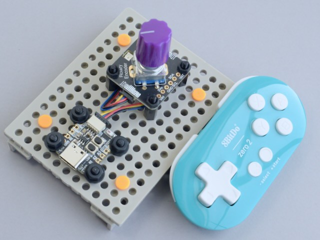

<!-- SPDX-License-Identifier: MIT -->
<!-- SPDX-FileCopyrightText: Copyright 2024 Sam Blenny -->
# BLE Gamepad

work in progress (alpha)

## Bluetooth Version Compatibility Problems

When I tried my 8BitDo Zero 2 and 8BitDo SN 30 Pro gamepads, neither of them
showed up with `adafruit_ble.BLERadio.start_scan()`. I don't have the right RF
test gear to verify which version of Bluetooth the gamepads are actually
advertising. But, I'm guessing it's probably Bluetooth Classic or perhaps
Bluetooth 4.x. When I tried a BLE scan with the iOS
[nRF Connect](https://apps.apple.com/us/app/nrf-connect-for-mobile/id1054362403)
app, it also failed to see either of my gamepads. But, they both showed up when
I scanned with `bluetoothctl` on Linux.

According to
[espressif's docs](https://docs.espressif.com/projects/esp-idf/en/stable/esp32s3/api-guides/bluetooth.html),
the ESP32-S3 chip I'm using appears to only support bluetooth 5.0 (definitely
*not* Classic; unsure about 4.x LE).

So, what to do? According to what I read, PowerA sells Bluetooth 5.0 gamepads
for use with Nintendo Switch. Seems like those might be worth a try. I also saw
an interesting wireless keyboard that uses Bluetooth 5.1. Not sure if 5.1 will
be backwards compatible with 5.0. Another option would be to try using the
[Adafruit USB Host BFF](https://www.adafruit.com/product/5956) with a wired USB
gamepad. Wireless seems more appealing though.

## Hardware

- 8BitDo Zero 2 Bluetooth gamepad
  ([product page](https://www.8bitdo.com/zero2/))

- Adafruit QT Py ESP32-S3 with 8MB Flash and no PSRAM
  ([product page](https://www.adafruit.com/product/5426),
  [learn guide](https://learn.adafruit.com/adafruit-qt-py-esp32-s3))

- Adafruit I2C Stemma QT Rotary Encoder Breakout with Encoder
  ([product page](https://www.adafruit.com/product/5880),
  [learn guide](https://learn.adafruit.com/adafruit-i2c-qt-rotary-encoder))

- Adafruit Violet Micro Potentiometer Knob - 4 pack
  ([product page](https://www.adafruit.com/product/5537))

- Adafruit STEMMA QT / Qwiic JST SH 4-pin Cable - 100mm
  ([product page](https://www.adafruit.com/product/4210))

## Getting Started

To begin, assemble the rotary encoder and knob,
[install CircuitPython 9.1](https://learn.adafruit.com/adafruit-qt-py-esp32-s3/circuitpython-2)
then copy the project bundle code to your CIRCUITPY drive. Once that's all done,
`code.py` will begin sending messages to the serial console. Use the rotary
encoder knob to select menu options.
