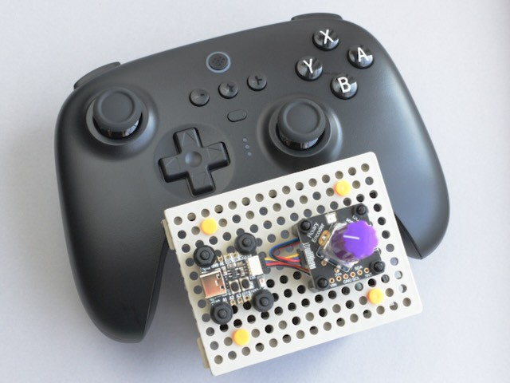

<!-- SPDX-License-Identifier: MIT -->
<!-- SPDX-FileCopyrightText: Copyright 2024 Sam Blenny -->
# BLE Gamepad

**work in progress (alpha)**

I wanted a solid no-solder-required gamepad option to use in future projects.
The trick is that many gamepads currently on the market use old Bluetooth
versions, while the ESP32-S3 radio needs Bluetooth 5.0 BLE.

## Bluetooth Version Compatibility Problems

[Espressif's docs](https://docs.espressif.com/projects/esp-idf/en/stable/esp32s3/api-guides/bluetooth.html),
for the ESP32-S3 say that it supports bluetooth 5.0, but not Bluetooth classic.

When I tried my old 8BitDo Zero 2 and 8BitDo SN 30 Pro gamepads, neither of
them showed up with `adafruit_ble.BLERadio.start_scan()`. But, when I tried an
8BitDo Ultimate Controller (Bluetooth 5.0 charging stand version), it did show
up.

Based on playing with a few Bluetooth scanner apps and reading *a lot* of
gamepad product pages, my best guess is that, most Bluetooth gamepads currently
on the market (July 2024) probably use Bluetooth Classic. The main exception is
some newer Nintendo Switch compatible gamepads that mention Bluetooth 5.0 in
their specifications.

If you want to use a gamepad with an ESP32-S3, be sure to check the
manufacturer specs carefully. Gamepads that don't specifically mention
"Bluetooth 5.0" are unlikely to work with the S3's radio. Also, keep in mind
that if you get a Bluetooth 5.0 gamepad designed to act like a Switch Pro
controller, there's a good chance it may be incompatible with games designed
for use with Xinput controllers.

## Hardware

- 8BitDo Ultimate Controller with Charging Dock (Bluetooth 5.0 gamepad)
  ([product page](https://www.8bitdo.com/ultimate-bluetooth-controller/))

- Adafruit QT Py ESP32-S3 with 8MB Flash and no PSRAM
  ([product page](https://www.adafruit.com/product/5426),
  [learn guide](https://learn.adafruit.com/adafruit-qt-py-esp32-s3))

- Adafruit I2C Stemma QT Rotary Encoder Breakout with Encoder
  ([product page](https://www.adafruit.com/product/5880),
  [learn guide](https://learn.adafruit.com/adafruit-i2c-qt-rotary-encoder))

- Adafruit Violet Micro Potentiometer Knob - 4 pack
  ([product page](https://www.adafruit.com/product/5537))

- Adafruit STEMMA QT / Qwiic JST SH 4-pin Cable - 100mm
  ([product page](https://www.adafruit.com/product/4210))

## Getting Started

To begin, assemble the rotary encoder and knob,
[install CircuitPython 9.1](https://learn.adafruit.com/adafruit-qt-py-esp32-s3/circuitpython-2)
then copy the project bundle code to your CIRCUITPY drive. Once that's all done,
`code.py` will begin sending messages to the serial console. Use the rotary
encoder knob to select menu options.
